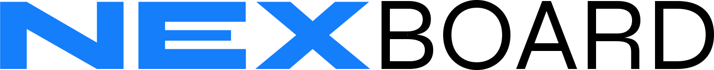

<p align="center">
   
</p>

<p align="center">
  
  <a href="https://github.com/Nirayuki/NexBoard/commits/master">
    
  </a>
  
  
  <a href="https://github.com/Nirayuki/NexBoard/stargazers">
    
  </a>
</p>

<div align="center">
  <sub>NexBoard. Built with 💙 by
    <a href="https://github.com/Nirayuki">Aron "Nirayuki" Kerkhoven</a> and
    <a href="https://github.com/Nirayuki/NexBoard/graphs/contributors">
      contributors
    </a>
  </sub>
</div>

# 📌 Table of Contents

- [📌 Table of Contents](#-table-of-contents)
- [👀 Demo Website](#-demo-website)
- [💻 Technologies](#-technologies)
- [🚀 Features](#-features)
- [🚧 How to run](#-how-to-run)
- [🐛 Issues](#-issues)
- [🎉 Contributing](#-contributing)
- [📕 License](#-license)

# 👀 Demo Website

👉  Demo: https://nexboard.netlify.app/

# 💻 Technologies

This project was made using the follow technologies:

* ReactJS
* NextJS
* Javascript
* JSON
* Styled Components

# 🚀 Features

News website about games, video games, movies, series, technology and more...

# 🚧 How to run

```bash
# Clone Repository
$ git clone https://github.com/Nirayuki/todo.git
$ Go to folder using terminal
$ yarn (needs yarn installed)
$ yarn dev (if you wanna change something) // yarn start (just to see running)
```

If you want something, wait for `yarn build` to be obeyed, and after that open a little change decision!

# 🐛 Issues

Feel free to **file a new issue** with a respective title and description on the [NexBoard](https://github.com/Nirayuki/NexBoard/issues) repository. If you already found a solution to your problem, **i would love to review your pull request**!

# 🎉 Contributing

First of all, thank you for being interested in helping out, your time is always appreciated in every way. :100:

Here's some tips:

* Check the [issues page](https://github.com/Nirayuki/NexBoard/issues) for already opened issues (or maybe even closed ones) that might already address your question/bug/feature request.
* Feature requests are welcomed! Provide some details on why it would be helpful for you and others, explain how you're using bull-board and if possible even some screenshots if you are willing to mock something!

# 📕 License

Released in 2013

Made by [Aron Felippe](https://github.com/Nirayuki).
This project is under the [MIT license](./LICENSE).


